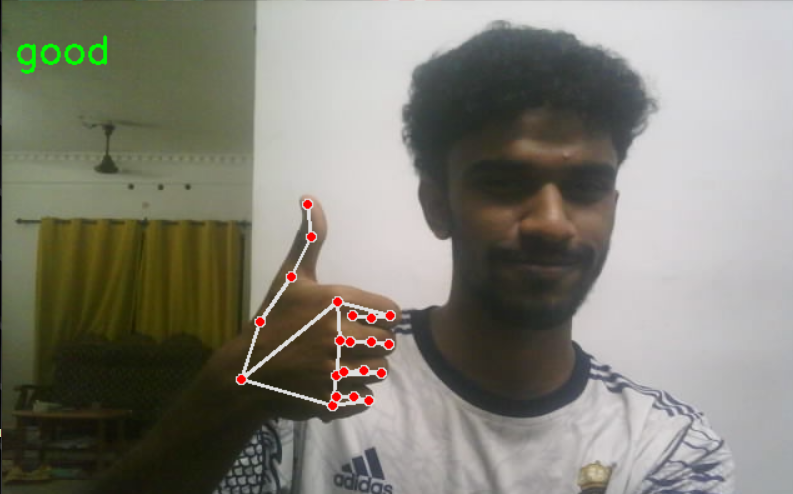
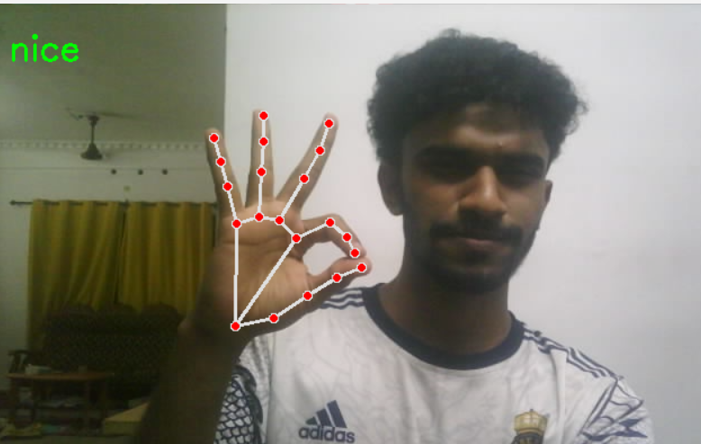

# Real-Time Gesture Recognition using MediaPipe and TensorFlow

This is a beginner-friendly real-time gesture recognition project using MediaPipe and a neural network classifier built with TensorFlow. The model is trained on custom gestures and can recognize hand signs like "Good" and "Nice".

## 📸 Demo

| Gesture | Screenshot |
|--------|-------------|
| Good 👍 |  |
| Nice 👌 |  |

## 🛠 Features

- Real-time hand landmark detection with MediaPipe
- Neural network-based gesture classification
- Trained using custom dataset saved as a pickle file
- Gesture overlay and prediction in webcam feed

## 🧪 Requirements

Install required libraries using:

```bash
pip install -r requirements.txt
```

**requirements.txt** should include:
```
mediapipe
tensorflow
numpy
opencv-python
```

## 🚀 Run the Project

```bash
python real_time_gesture_recognition.py
```

Make sure the following files are in the same folder:
- `gesture_model.h5` (trained model)
- `dataset.pickle` (custom dataset)
- `real_time_gesture_recognition.py` (main script)

## 🙋‍♂️ Author

This is my first project uploaded to GitHub. Built with passion and curiosity to learn computer vision and AI.

## 📂 Screenshots

Additional screenshots available in the `screenshots` folder.
